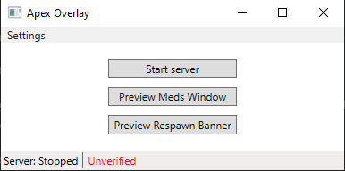
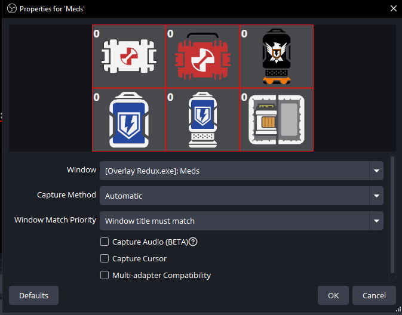
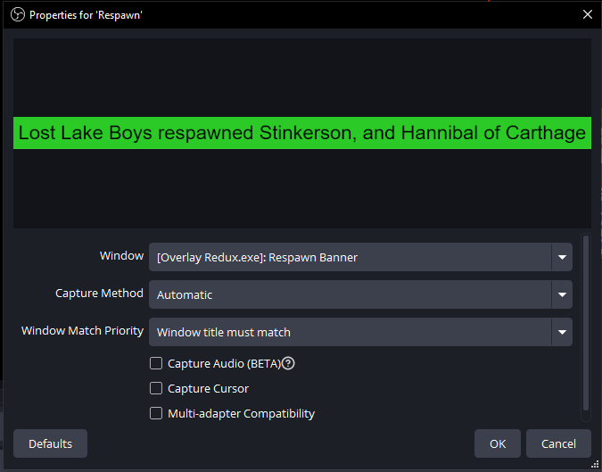
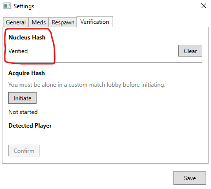

# Apex Overlay

## Installing and setup

The most recent version of the program can be found in Releases on the right side of the page. If Windows yells at you about a security risk there should be an option to see more details and/or run anyways.

The exe runs on its own so you shouldn't need to install anything.

In order to use this you must be running apex on the same computer that is running on and have the liveapi enabled.

### Enabling the LiveAPI

#### Launch args

Right click the game in your library and then click properties. You'll see a box that says "Launch properties," copy and paste the following bit into that box.

`+cl_liveapi_enabled 1 +cl_liveapi_use_protobuf 0 +cl_liveapi_ws_servers "ws://127.0.0.1:7777"`

## Running the overlay

### Start server

This is the main button for the program. This should be pressed before launching the game to give the best chance of it connecting (Apex can be finnicky sometimes if this is pressed after the game is launched).

The status bar at the bottom will update to say "Waiting to connect..." and then "Connected!"

### Overlay Items

The two preview buttons are so you can add the windows to your streaming software and see the changes in real-time as you customize colors. The program will open/close the windows automatically.

#### Preview Meds Window

The meds window will open and close based on the match starting/ending.

You need to set the Window Match Priority to "Must match"

#### Preview respawn banner

The respawn banner will open and close whenever a respawn happens in game. The banner will be open for 5 seconds.

You need to set the Window Match Priority to "Must match"

## Settings

### General

#### Active Windows

Check which windows you want to have active on your overlay.

If a window is unchecked the program won't create them during the game

### Meds / Respawn

You can update the colors used for the different windows. If you have the preview windows open they will update in real-time.

To confirm your changes you must click Save. If you don't it will revert to whatever colors were active before.

### Verification

This is primarily for handling co-casting or multiple observers in a lobby.

If there are multiple observers the meds tracker won't work correctly unless you "Verify" yourself.

The status and everything on this page will auto-save during the process.

1) This must be done in a custom lobby with only you in it. It doesn't need to be on an admin code so you can do the general private match

2) Once you are in the custom match click "Initiate"  

3) It should find you and fill in your in game name under "Detected Player" if/when it does press "Confirm"

4) It should then update the "Unverified" at the top to "Verified." If you are ever on a different account you can clear the verification and do the process again  
